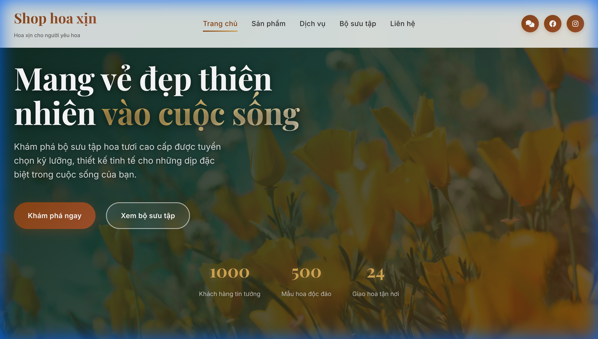
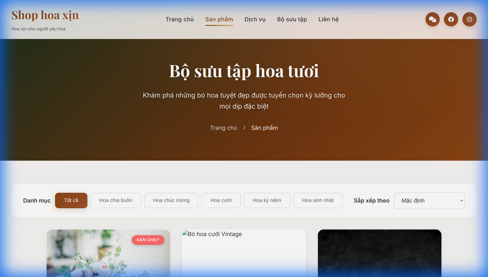
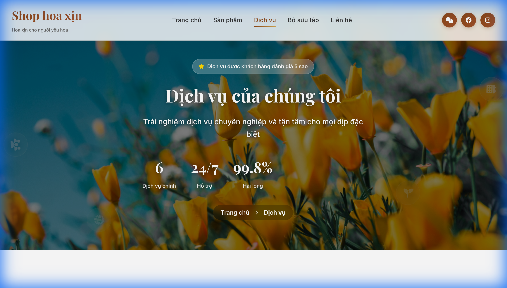
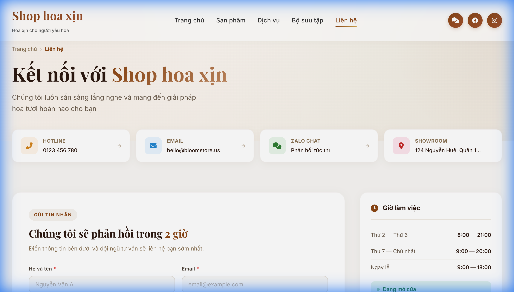
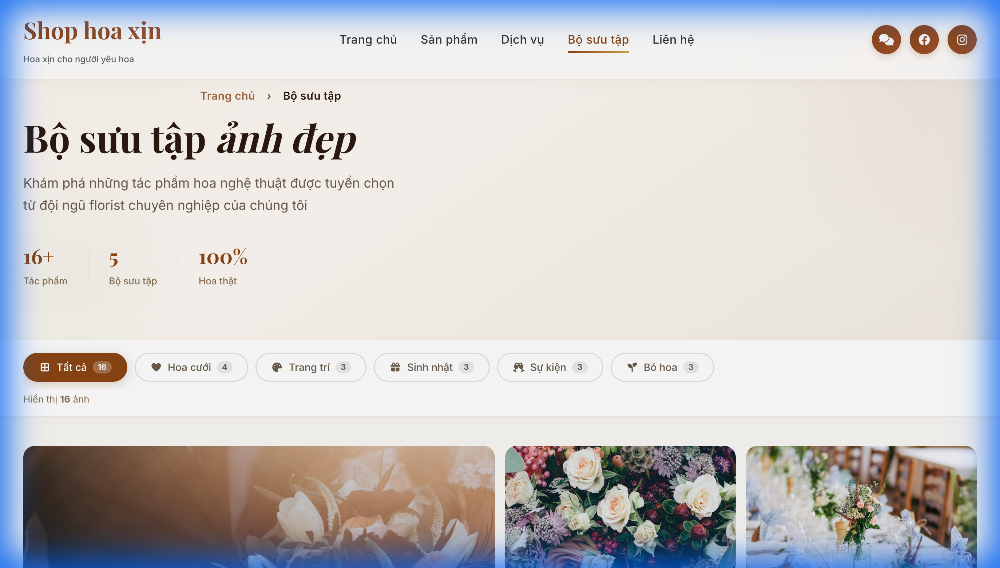
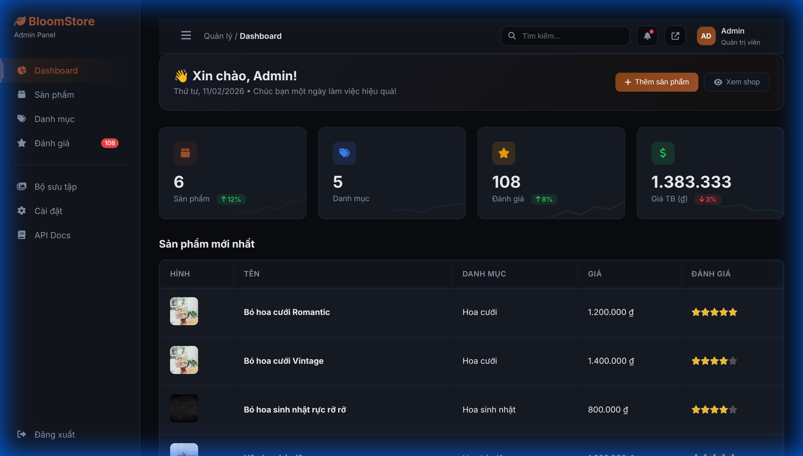
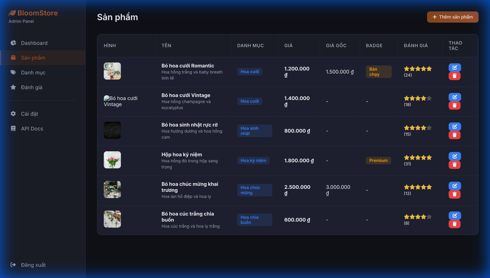
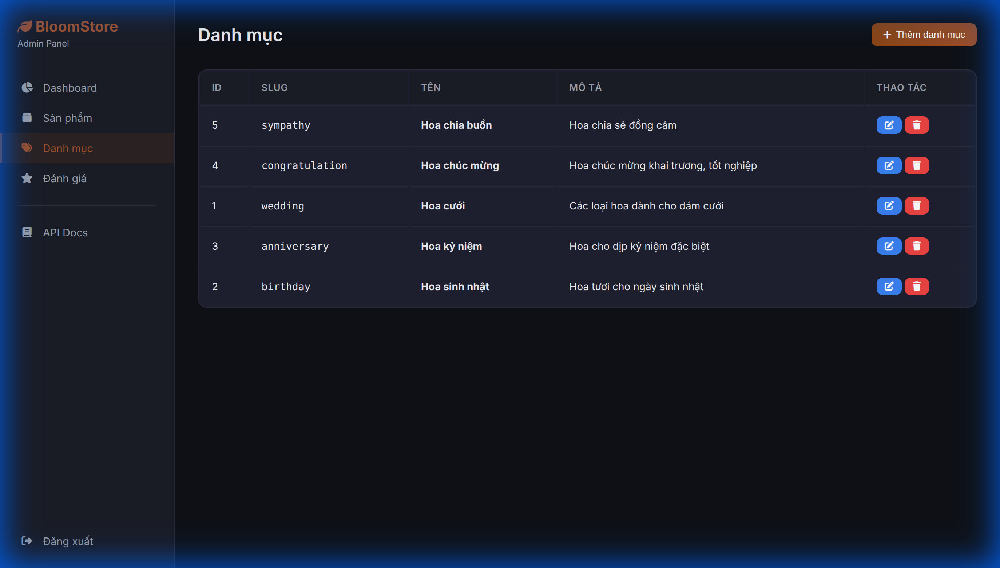
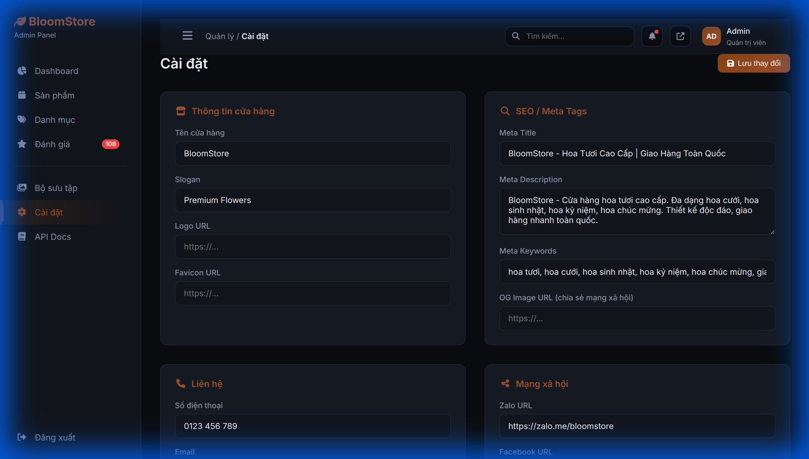

# 🌸 BloomStore — Shop Hoa Online

Website thương mại điện tử bán hoa chuyên nghiệp, xây dựng bằng **React** (frontend) + **NestJS** (backend) + **MariaDB**.

---

## 📸 Screenshots

### 🏠 Trang chủ


### 🛒 Sản phẩm


### 🎨 Dịch vụ


### 📞 Liên hệ


### 🖼️ Thư viện ảnh


### 🔧 Admin Panel — Dashboard


### 📦 Admin Panel — Quản lý sản phẩm


### 🏷️ Admin Panel — Quản lý danh mục


### ⚙️ Admin Panel — Cài đặt


---

## ✨ Tính năng

### Frontend (React)
- **Trang chủ** — Hero banner, sản phẩm nổi bật, dịch vụ, thống kê
- **Sản phẩm** — Lọc theo danh mục, sắp xếp (giá, mới nhất, đánh giá), tìm kiếm
- **Chi tiết sản phẩm** — Gallery ảnh, mô tả, SEO metadata, đánh giá
- **Dịch vụ** — Trình bày dịch vụ với animation
- **Liên hệ** — Form gửi tin nhắn, Google Maps, thông tin liên hệ
- **Thư viện ảnh** — Gallery với bộ lọc danh mục
- **Responsive** — Tương thích mobile, tablet, desktop

### Backend (NestJS)
- **REST API** với Swagger documentation
- **Admin Panel** — Quản lý sản phẩm, danh mục, đánh giá, cài đặt
- **Authentication** — JWT, đổi mật khẩu
- **Upload ảnh** — Tự động convert WebP, resize, optimize
- **SEO-friendly** — Auto-generate slug từ tiếng Việt
- **Settings** — Quản lý thông tin shop động từ admin

### Bảo mật
- ✅ Helmet security headers
- ✅ CORS cấu hình theo môi trường
- ✅ JWT Auth Guards trên tất cả write endpoints
- ✅ Input validation (class-validator)
- ✅ XSS prevention (HTML escaping trong admin panel)
- ✅ Bcrypt password hashing
- ✅ Parameterized queries (chống SQL injection)
- ✅ File upload filter + size limit

---

## 🚀 Cài đặt & Chạy

### Yêu cầu
- Node.js 18+
- Docker & Docker Compose (cho MariaDB)

### Development

```bash
# 1. Clone repo
git clone https://github.com/phuctu1901/web-shop-hoa.git
cd web-shop-hoa

# 2. Khởi động database
docker compose up -d

# 3. Cài đặt & chạy backend
cd backend
npm install
npm run start:dev
# Backend chạy tại http://localhost:3000

# 4. Cài đặt & chạy frontend (terminal mới)
cd ..
npm install
PORT=3456 npm start
# Frontend chạy tại http://localhost:3456
```

### Truy cập
| URL | Mô tả |
|-----|-------|
| http://localhost:3456 | Frontend (React) |
| http://localhost:3000/quanly/ | Admin Panel |
| http://localhost:3000/api/docs | Swagger API Docs |

**Admin Login:** `admin` / `admin123`

---

## 🌐 Deploy lên VPS

### Yêu cầu VPS
- Ubuntu 20.04+
- Nginx, Docker, Node.js 18+, PM2

### Các bước deploy

```bash
# 1. Cài đặt dependencies
sudo apt update && sudo apt install -y nginx docker.io docker-compose
curl -fsSL https://deb.nodesource.com/setup_18.x | sudo -E bash -
sudo apt install -y nodejs
npm install -g pm2

# 2. Clone & config
git clone https://github.com/phuctu1901/web-shop-hoa.git /var/www/bloomstore
cd /var/www/bloomstore
cp .env.example .env
nano .env  # Sửa JWT_SECRET, DB passwords

# 3. Deploy tự động
chmod +x deploy.sh
./deploy.sh

# 4. SSL Certificate
sudo certbot --nginx -d shophoa.techcave.space
```

### File cấu hình
| File | Mục đích |
|------|----------|
| `.env.example` | Template biến môi trường |
| `ecosystem.config.js` | PM2 process manager |
| `nginx/bloomstore.conf` | Nginx reverse proxy |
| `deploy.sh` | Script deploy tự động |
| `docker-compose.yml` | MariaDB container |

---

## 🏗️ Cấu trúc dự án

```
web-shop-hoa/
├── src/                    # React frontend
│   ├── components/         # Header, Footer
│   ├── pages/              # Home, Products, Services, Contact, Gallery
│   ├── context/            # SettingsContext
│   ├── styles/             # CSS files
│   └── api.js              # API helper
├── backend/                # NestJS backend
│   ├── src/
│   │   ├── auth/           # JWT auth, login, change password
│   │   ├── products/       # CRUD sản phẩm
│   │   ├── categories/     # CRUD danh mục
│   │   ├── reviews/        # Đánh giá
│   │   ├── settings/       # Cài đặt shop
│   │   ├── gallery/        # Thư viện ảnh
│   │   ├── upload/         # Upload & convert ảnh
│   │   └── main.ts         # Entry point
│   └── public/admin/       # Admin panel HTML
├── docs/screenshots/       # Screenshots
├── nginx/                  # Nginx config
├── deploy.sh               # Deploy script
├── ecosystem.config.js     # PM2 config
└── docker-compose.yml      # Database
```

---

## 📡 API Endpoints

| Method | Endpoint | Auth | Mô tả |
|--------|----------|------|-------|
| GET | `/api/products` | ❌ | Danh sách sản phẩm |
| GET | `/api/products/:id` | ❌ | Chi tiết sản phẩm |
| POST | `/api/products` | ✅ | Tạo sản phẩm |
| PATCH | `/api/products/:id` | ✅ | Cập nhật sản phẩm |
| DELETE | `/api/products/:id` | ✅ | Xóa sản phẩm |
| GET | `/api/categories` | ❌ | Danh sách danh mục |
| GET | `/api/settings` | ❌ | Cài đặt shop (public) |
| PUT | `/api/settings` | ✅ | Cập nhật cài đặt |
| GET | `/api/reviews?productId=` | ❌ | Đánh giá theo sản phẩm |
| POST | `/api/reviews` | ❌ | Tạo đánh giá |
| POST | `/api/auth/login` | ❌ | Đăng nhập admin |
| PUT | `/api/auth/change-password` | ✅ | Đổi mật khẩu |
| POST | `/api/upload` | ✅ | Upload ảnh |
| GET | `/api/gallery` | ❌ | Thư viện ảnh |

---

## 📝 License

MIT © BloomStore Team